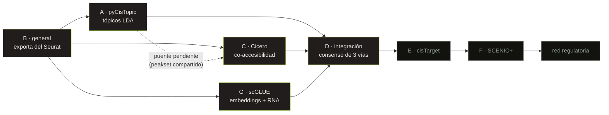

## La idea

De scATAC-seq a una **red de regulación génica**, por tres rutas independientes que se
cruzan al final.

Los datos dicen qué partes del genoma están abiertas en cada célula. De ahí a saber
*qué regula a qué* hay un salto, y hay más de una forma de darlo. Este pipeline da tres
a la vez:

- **Tópicos LDA** ([rama A](a-pycistopic/)) — conjuntos de regiones que se abren juntas.
- **Co-accesibilidad** ([rama C](c-cicero/)) — pares de picos que se abren al mismo tiempo, agrupados en bloques.
- **Embeddings con RNA** ([rama G](g-scglue/)) — la única ruta que ve expresión, no solo accesibilidad.

Las tres se comparan en un [paso de integración](d-integrate/). Solo los pares
región-gen respaldados por las tres señales pasan a la fase final. **Los pares donde
las señales no coinciden no se tiran: se conservan etiquetados**, porque el desacuerdo
entre métodos independientes también dice algo.

## El flujo

## Dónde está cada cosa

| Rama | Qué hace | Estado |
|---|---|---|
| [B — general](b-general/) | Exporta peaks, barcodes y metadata del objeto Seurat integrado | Un paso migrado, uno pendiente |
| [A — pyCisTopic](a-pycistopic/) | Tópicos LDA sobre la accesibilidad | Migrada a Nextflow; el paso 09 está roto |
| [C — Cicero](c-cicero/) | CCANs por co-accesibilidad | Corre en bash; usa el peakset equivocado |
| [G — scGLUE](g-scglue/) | Inferencia regulatoria desde embeddings | Implementada y probada |
| [D — integración](d-integrate/) | Consenso de tres vías + comparación de señales | Consenso probado; falta el visualizador |
| [E — cisTarget](e-cistarget/) | Motivos de factores de transcripción | Sin empezar |
| [F — SCENIC+](f-scenicp/) | Red final | Sin empezar |

Transversal a todas: [la migración a Nextflow](nextflow/) y el [glosario](sintaxis/).

## Cómo leer esto

Tres niveles de zoom. Baja solo hasta donde te interese:

