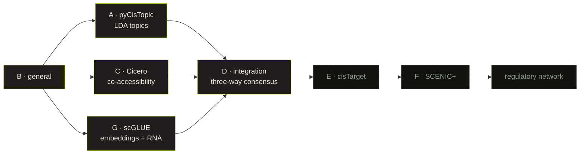

## The problem

scATAC-seq tells you which parts of the genome are open in each cell. Getting from
there to **what regulates what** is a leap, and there is more than one way to take it.
This pipeline takes three at once and then compares them.

| Existing capabilities | New GRN capabilities |
|---|---|
| Filter scATAC-seq data by quality | Discover synchronously activated regions |
| Group cells by accessible regions | Map enhancer-to-target interactions |
| Perform differential accessibility | Identify regulatory topics and cellular archetypes |

## Three routes, one consensus

- **LDA topics** — sets of regions that open together.
- **Co-accessibility** — pairs of peaks that open at the same time, grouped into CCANs.
- **Embeddings with RNA** — the only route that sees expression, not just accessibility.

Only region-gene pairs backed by all three signals move on to the final stage. Pairs
where the signals disagree are **kept and labelled, not discarded** — disagreement
between independent methods is itself informative.

That the three agree at all was not a given. Two of them, built on completely
independent evidence, converge on the same regions **3.77× more often than chance**,
and — given a shared region — on the same gene **81.6% of the time** against ~0.1%
expected. The consensus is not noise.

## The full guide is in Spanish

The complete technical documentation — one section per branch, every Nextflow module,
and a glossary you can read by hovering over any note link — lives on the Spanish side
of this site:

**[→ Leer la guía completa](/Vulgaris/es/projects/jaguar/)**

It is written in Spanish on purpose: it started as my own lab notebook, and that is
where the explanations are clearest. Translating it is a separate job.
